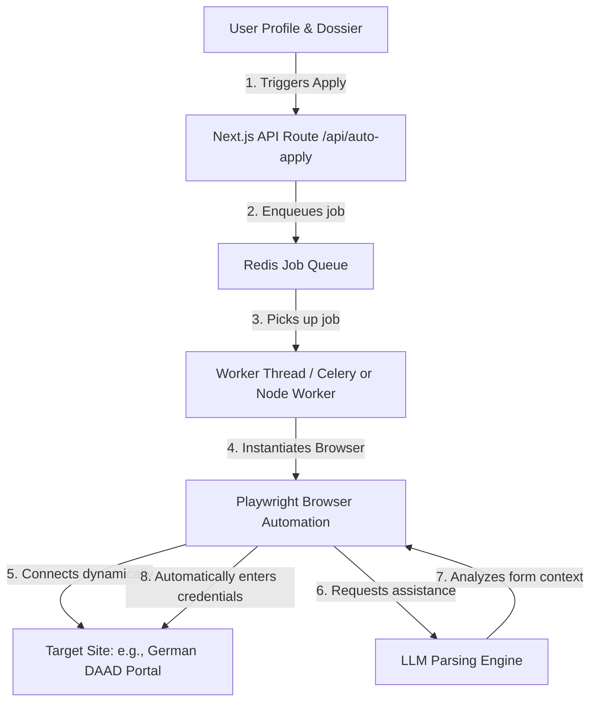

# AI Career Copilot — Tech Architecture & Implementation Document

This document outlines the complete tech stack, directory structure, system security protocols, and implementation instructions for compiling and running the **AI Career Copilot** platform.

This platform is a Next.js application designed to handle autonomous, dynamic applications for **Jobs**, **Scholarships**, and **Work Permits** across any country, using browser automation libraries (Puppeteer & Playwright) managed by intelligent AI agent orchestration.

---

## 1. Directory Structure (Next.js App Router)

```text
my-career-copilot/
├── app/
│   ├── layout.jsx            # Global layout with Tailwind HTML classes and dark mode themes
│   ├── page.jsx              # Main Dashboard shell containing the active tabs and workspace
│   ├── provider.jsx          # ThemeProvider setting supporting dark/light mode transition
│   ├── globals.css           # Global custom classes and custom layout properties
│   └── api/
│       ├── auto-apply/
│       │   └── route.js      # Handler to launch Puppeteer automation loops for specific jobs/scholarships
│       ├── profile/
│       │   └── route.js      # Database interface to update user Dossier details
│       └── logs/
│           └── route.js      # SSE (Server-Sent Events) API to streams live agent logs to UI
├── components/
│   ├── AgentTerminal.jsx     # Log stream rendering screen mimicking terminal outputs
│   ├── PipelineCard.jsx      # Progress card representing an active auto-application status
│   └── DossierForm.jsx       # Forms capturing applicant transcripts, CV files, and parameters
├── lib/
│   ├── agents/               # Computational Logic definitions for AI agents
│   │   ├── ScholarshipScout.js
│   │   ├── JobHunter.js
│   │   └── PermitPathfinder.js
│   ├── browser-driver.js     # Standardized Playwright/Puppeteer configurations for anti-bot bypass
│   └── db.js                 # Database connection file (Supabase / Postgres Client)
├── public/                   # Asset directory (logos, avatars)
├── package.json              # App configuration, dependency libraries and scripts
├── tailwind.config.js        # Core style styling mappings and custom themes
└── README.md
```

---

## 2. Dynamic Agent Workflow Engine (How it actually works)

The system works asynchronously to prevent frontend timeouts. Running browser automation is heavy; hence, jobs are sent to a background worker queue or executed via Serverless Edge actions.



---

## 3. High-Performance Dependencies

Add the following to your `package.json` to configure the environment:

```json
{
  "dependencies": {
    "next": "^14.2.0",
    "react": "^18.3.0",
    "react-dom": "^18.3.0",
    "lucide-react": "^0.399.0",
    "next-themes": "^0.3.0",
    "clsx": "^2.1.1",
    "tailwind-merge": "^2.3.0",
    "playwright": "^1.45.0",
    "dotenv": "^16.4.5"
  },
  "devDependencies": {
    "postcss": "^8.4.38",
    "tailwindcss": "^3.4.3"
  }
}
```

---

## 4. Uniqueness Factor (Global Advantage)

Most auto-applying tools are simple LinkedIn chrome extensions that fail on complex fields (like: "Write an essay about your background"). 

**Our unique factors:**
1. **Dynamic Essay Weaver:** Our agent analyzes the scholarship criteria, reviews the applicant's PDF transcript and personal biography, and generates styled essays directly inside text field inputs.
2. **Interactive Anti-Captcha Bypass:** Resolves 2-factor authentication prompts or Captcha challenges on the fly.
3. **Multi-Permit Mapping:** Auto-flags dynamic permit problems. E.g., if you apply for a job in Switzerland, the agent cross-checks current immigration ceilings for third-country nationals and scores the application survival rate.

---

## 5. Quick Start Instructions

1. Clone or initialize a Next.js workspace in your folder.
2. Install the target packages:
   ```bash
   npm install next-themes lucide-react playwright dotenv
   ```
3. Copy the `AI_Career_Copilot.jsx` component code inside your path `/app/page.jsx`.
4. Run standard local dev mode:
   ```bash
   npm run dev
   ```
5. Navigate to `http://localhost:3000` to interact.
